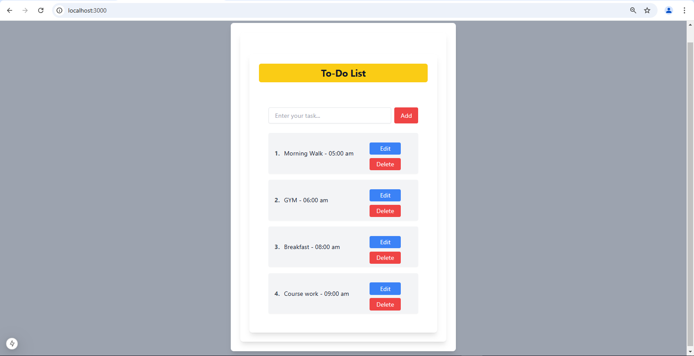

# Task 05: 📋 To-Do List App in Next.js 

A **To-Do List Application** built using **Next.js**, **React**, **TypeScript**, and **Tailwind CSS**. This app provides a clean interface to add, delete, and edit tasks.

## 🚀 Features

1. **Add Tasks**  
   Allows users to add new tasks to the list seamlessly.

2. **Delete Tasks**  
   Users can remove tasks they no longer need.

3. **Edit Tasks**  
   Inline task editing functionality to modify task details.

4. **Responsive Design**  
   Clean, user-friendly, and responsive UI powered by **Tailwind CSS**.

---

## 🛠️ Tech Stack

- **Next.js**: Server-rendered React framework.  
- **React**: Component-based UI library.  
- **TypeScript**: Ensures type safety and better developer experience.  
- **Tailwind CSS**: Utility-first CSS framework for responsive design.  

---

## 📂 Project Structure

The project is organized as follows:

```
task05-todo-app/
│
├── public/              # Static assets (icons, fonts)
├── src/
│   ├── app/             # Main application files
│   │   ├── components/
│   │   │   ├── TodoInput.tsx   # Input field for adding tasks
│   │   │   └── TodoList.tsx    # Task list with delete & edit options
│   │   ├── layout.tsx          # App layout configuration
│   │   ├── page.tsx            # Main logic for To-Do list
│   │   └── globals.css         # Global Tailwind CSS styles
│
├── .eslintrc.json       # ESLint configuration
├── package.json         # Project dependencies
├── tailwind.config.ts   # Tailwind CSS configuration
├── tsconfig.json        # TypeScript configuration
└── README.md            # Project documentation
```
## 💻 Setup Instructions

Follow these steps to get started with the project:

### 1. Clone the Repository

Run the following command in your terminal:

```bash
git clone ***RepoLink***
cd **Project Directory**
```

### 2. Install Dependencies

### 3. Run the Development Server
Start the development environment with:

```bash
npm run dev
```
The app will be available at http://localhost:3000.

🖼️ **UI Preview**
Here's what the application looks like:


